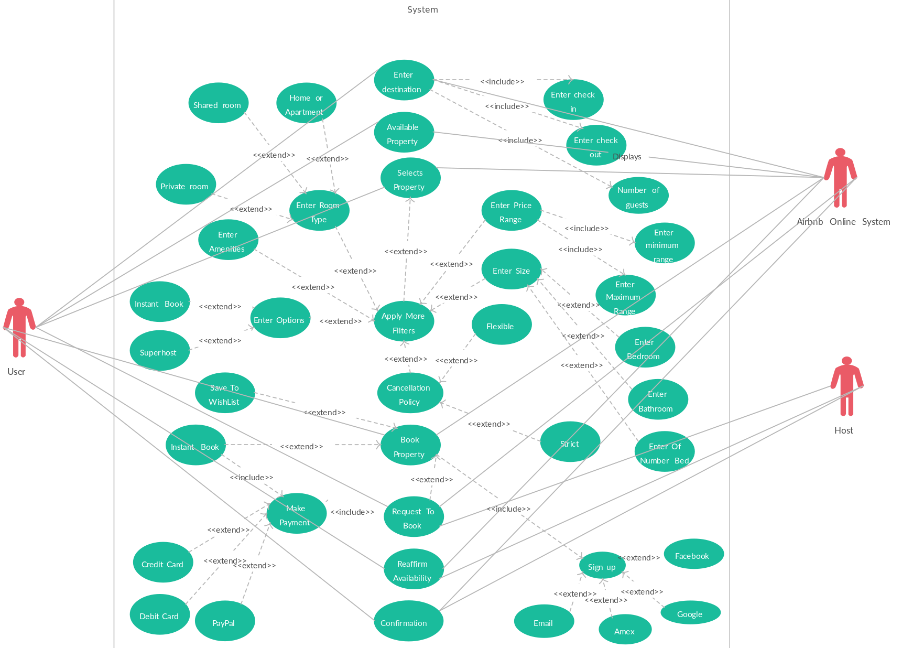

# Requirement Analysis in Software Development

This repository serves as a blueprint for the requirement analysis phase of a booking management system. It contains documentation, diagrams, and key artifacts that define the project's foundation, simulating a real-world software development scenario. The goal is to translate project needs into structured, clear, and actionable requirements.

---

## What is Requirement Analysis?

**Requirement Analysis** is the process of defining, documenting, and managing the needs and constraints for a software system. It involves gathering requirements from stakeholders, analyzing them for clarity and consistency, and creating a detailed specification. This phase is a critical part of the **Software Development Lifecycle (SDLC)** because it ensures that all parties involved have a shared understanding of what the final product should do.

The importance of this step cannot be overstated. A thorough requirement analysis helps to:

* **Prevent project failure:** By identifying potential issues early, it reduces the risk of building the wrong product.
* **Reduce costs:** Changes made late in the development cycle are significantly more expensive to implement.
* **Improve communication:** It creates a common language for developers, designers, and stakeholders, minimizing misunderstandings.
* **Provide a foundation for testing:** Clear requirements form the basis for creating test cases and validating the final product.
---

## Why is Requirement Analysis Important?

Requirement analysis is a cornerstone of successful software development. It's crucial because it sets a clear, shared vision for the project, minimizing risks and ensuring the final product meets its goals. Here are three key reasons why it's so critical:

* **Risk Mitigation**: By thoroughly analyzing requirements upfront, potential issues like scope creep, conflicting needs, and technical feasibility can be identified and addressed early on. This proactive approach saves time and money by preventing costly rework later in the development cycle.
* **Improved Communication**: A well-documented set of requirements serves as a single source of truth for all stakeholders—developers, designers, testers, and clients. This shared understanding minimizes misunderstandings and ensures everyone is aligned on the project's objectives.
* **Basis for Validation and Testing**: Clear requirements provide the criteria needed to validate the final product. Each requirement can be translated into a test case, allowing the QA team to verify that the software functions as intended and meets the specified needs.

---

## Key Activities in Requirement Analysis

Requirement analysis is a systematic process composed of several key activities. Each step ensures that the needs of the system are accurately captured, documented, and refined.

* **Requirement Elicitation**: This is the process of gathering requirements from various stakeholders. Techniques include interviews, surveys, workshops, and observation to understand what users need and expect from the system.
* **Requirement Documentation**: The gathered requirements are formally written down in a clear, unambiguous, and structured manner. This often results in a **Software Requirements Specification (SRS)** document.
* **Requirement Analysis and Modeling**: The documented requirements are analyzed for consistency, completeness, and feasibility. This step involves creating models like use case diagrams or flowcharts to visualize the system and its interactions.
* **Requirement Validation**: This activity ensures that the requirements accurately reflect the user's needs and that the documented specifications are correct. It involves reviewing requirements with stakeholders to get their approval.
* **Requirement Management**: This ongoing process handles changes to requirements throughout the project lifecycle. It ensures that changes are tracked, approved, and communicated to all team members.

---

## Types of Requirements

Software requirements can be broadly categorized into two main types: **Functional** and **Non-functional**.

#### Functional Requirements

**Functional requirements** define what the system **must do**. They describe the specific behaviors and functions of the software. For a booking management system, examples include:

* **User Registration**: The system shall allow new users to create an account by providing an email address and a password.
* **Room Search**: The system shall allow a user to search for available rooms based on dates, location, and number of guests.
* **Booking Creation**: The system shall allow a registered user to book an available room and receive a booking confirmation.

#### Non-functional Requirements

**Non-functional requirements** specify **how** the system performs a certain function. They describe the system's quality attributes, such as performance, security, and usability. For a booking management system, examples include:

* **Performance**: The system shall display search results within 3 seconds for a query of up to 1000 listings.
* **Security**: The system shall encrypt all user passwords and personal information using industry-standard protocols.
* **Usability**: The booking process shall be intuitive and require a maximum of five clicks to complete from the search results page.
* **Scalability**: The system shall be able to handle 10,000 concurrent users without any degradation in performance.
---

## Use Case Diagrams

**Use Case Diagrams** are a type of behavioral diagram in the **Unified Modeling Language (UML)** that illustrate a system's functionality in terms of actors and use cases. They provide a high-level, visual overview of the system's requirements, showing who interacts with the system (**actors**) and what they can do (**use cases**).

Their benefits include:

* **Clarity**: They simplify complex system interactions into an easy-to-understand visual representation.
* **Stakeholder Communication**: They serve as a great tool for discussing and validating requirements with non-technical stakeholders.
* **Scope Definition**: They help in defining the boundaries of the system and identifying all necessary functionalities.

### Booking System Use Case Diagram

Here is a use case diagram illustrating the core functionalities of the booking management system.

